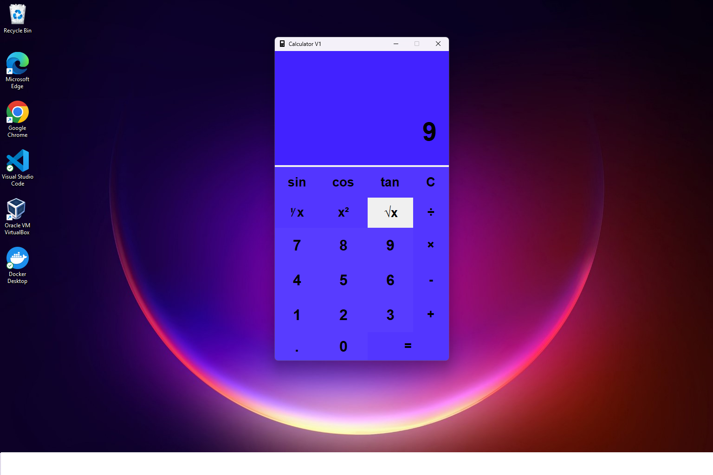

 

## This README file contains:
-The purpose of this project  
-Instructions for using the calculator  
-How to change styling elements 
-Project Photos   

## Project Purpose

The purpose of this project is to improve upon the pre-installed Calculator app found on Windows.

The functions this calculator can perform are addition, subtraction, multiplication, division, reciprocal, squaring, square root, cosine, sine and tangent. This calculator has a dark blue theme contrasted with a black font.  

## Instructions

1. Ensure that all necessary dependencies are installed then Make sure Python 3.10 or newer is configured as the Python intepreter for this folder.
2. Run main.py.
3. Click the number before using the evaluator buttons (Example: To find the square root of 5, click 5 and then click the sqrt button).  

## Changing styling elements

## Fonts

- To change the top display change the font equal to the variable 'top_screen_font'
- To change the main display change the font equal to the variable 'body_font'
- To change the button font change the font equal to the variable 'button_font'
- To change the operator font change the font equal to the variable 'operator_font'  

## Colors

- To change the calculator's main color change the hexidecimal equal to the variable 'calculator_color'
- To change the button's background color change the hexidecimal equal to 'button_background_color'
- To change the color of the operator buttons change the hexidecimal equal to the variable 'operator_button_color'
- To change the label color change the hexidecimal equal to the variable 'label_color'  

## Project Photos   
  
  